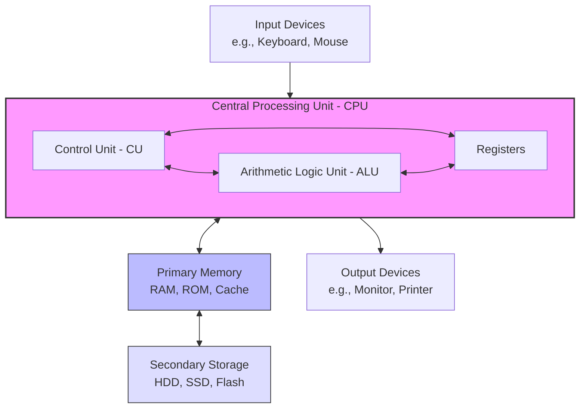
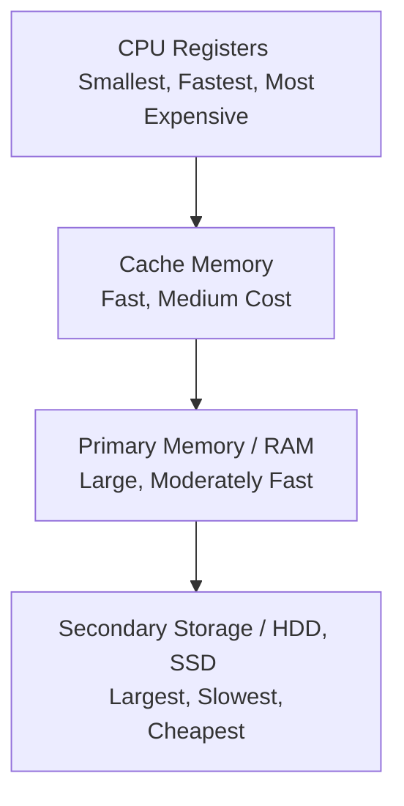
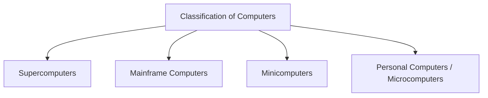

# Computer System and Organisation

## Part 1: Basic Computer Organisation

A computer system is an electronic device that accepts raw data as input, processes it according to a set of instructions (program), stores the data/results, and produces useful output.

### 1.1 Block Diagram of a Computer System
The diagram below represents the basic structural organization of a computer system, showcasing the interaction between the Input Unit, Central Processing Unit (CPU), Memory, and Output Unit.

---

### 1.2 Central Processing Unit (CPU)
The CPU is known as the "brain" of the computer. It executes instructions, performs calculations, and coordinates the flow of data across different units of the system. 

It consists of three main components:

*   **Arithmetic Logic Unit (ALU):**
    *   Performs arithmetic operations (Addition, Subtraction, Multiplication, Division).
    *   Performs logical operations (Comparisons such as AND, OR, NOT, Equal to, Greater than).
*   **Control Unit (CU):**
    *   Acts as the supervisor/manager of the computer.
    *   It fetches instructions from primary memory, decodes them, and directs other units (ALU, Memory, I/O devices) on how to execute them.
    *   It does not process or store data itself.
*   **Registers:**
    *   Extremely fast, temporary storage locations inside the CPU.
    *   They hold data and instructions currently being processed by the ALU.
    *   **Common Registers include:** Accumulator (AC), Program Counter (PC), Memory Address Register (MAR), and Instruction Register (IR).

---

### 1.3 Memory Hierarchy
Computer memory is structured hierarchically based on access time, cost, and capacity.

---

### 1.4 Primary Memory (Main Memory)
Primary memory is directly accessible by the CPU. It holds instructions and data that the computer is actively using.

#### A. Random Access Memory (RAM)
*   **Volatile Memory:** It loses its content as soon as the power supply is turned off.
*   **Read/Write Memory:** The CPU can both read data from and write data to RAM.
*   **Purpose:** Holds active applications, operating system components, and current processing data.

| Parameter | Static RAM (SRAM) | Dynamic RAM (DRAM) |
| :--- | :--- | :--- |
| **Basic Component** | Uses transistors (flip-flops) to store bits. | Uses capacitors and transistors. |
| **Speed** | Extremely fast. | Slower than SRAM. |
| **Refreshing** | Does not require periodic refreshing. | Needs to be refreshed thousands of times per second. |
| **Cost** | Expensive. | Cheaper. |
| **Usage** | Used to make Cache memory. | Used to make main system RAM. |

#### B. Read-Only Memory (ROM)
*   **Non-Volatile Memory:** It retains its contents even when the power is turned off.
*   **Read-Only:** The CPU can only read instructions from it; it cannot write new data during standard operation.
*   **Purpose:** Stores startup instructions (BIOS/bootloader) required to turn on the computer.

| ROM Type | Full Form | Characteristics |
| :--- | :--- | :--- |
| **PROM** | Programmable Read-Only Memory | Can be written to (programmed) only once by the user/manufacturer. |
| **EPROM** | Erasable Programmable Read-Only Memory | Contents can be erased by exposing the chip to strong Ultraviolet (UV) light. |
| **EEPROM** | Electrically Erasable Programmable Read-Only Memory | Contents can be erased and rewritten electrically. Used in modern BIOS chips. |

#### C. Cache Memory
*   **What it is:** A very high-speed semiconductor memory placed between the CPU and the primary RAM.
*   **Purpose:** It stores frequently accessed instructions and data so the CPU does not have to wait for the slower RAM.
*   **Levels:** Cache is generally split into L1 (fastest, smallest, built into the CPU), L2, and L3 cache.

---

### 1.5 Secondary Storage Devices
Since primary memory is volatile and limited in capacity, secondary storage devices are used to store data, files, and applications permanently.

*   **Magnetic Storage Devices:**
    *   *Hard Disk Drive (HDD):* Uses magnetic platters to store data. High capacity at a low cost, but contains moving parts.
*   **Solid-State Storage Devices:**
    *   *Solid State Drive (SSD):* Uses flash memory to store data. Extremely fast, silent, consumes less power, and has no moving parts.
    *   *Flash Drives / Pen Drives & Memory Cards:* Portable solid-state media used for transferring files.
*   **Optical Storage Devices:**
    *   *CD (Compact Disc), DVD (Digital Versatile Disc), Blu-ray Disc:* Use lasers to read and write data from pits on a reflective surface.

#### Comparison: Primary Memory vs. Secondary Storage

| Feature | Primary Memory (RAM) | Secondary Storage (HDD/SSD) |
| :--- | :--- | :--- |
| **Nature** | Volatile (temporary). | Non-volatile (permanent). |
| **Access Speed** | Very fast (nanoseconds). | Relatively slower (microseconds/milliseconds). |
| **Direct CPU Access** | Yes, directly accessed via the system bus. | No, must be loaded into RAM first. |
| **Capacity** | Typically smaller (e.g., 8 GB to 32 GB). | Typically much larger (e.g., 512 GB to 4 TB). |

---

### 1.6 Input/Output (I/O) Devices
I/O devices act as the interface between the human user and the computer system.

*   **Input Devices:** Convert human-understandable data into a machine-readable binary format.
    *   *Keyboard:* Inputs alphanumeric data.
    *   *Mouse:* Pointing device used to navigate graphical interfaces.
    *   *Scanner:* Converts physical documents/images into digital format.
    *   *Microphone:* Inputs audio signals.
*   **Output Devices:** Convert the processed binary results back into a human-readable format.
    *   *Monitor (Visual Display Unit):* Displays visual output (Soft copy).
    *   *Printer:* Produces a physical copy of digital documents (Hard copy).
    *   *Speakers:* Outputs sound.
    *   *Projector:* Projects display output onto a large screen.

---

### 1.7 Units of Memory
Computers work entirely in binary (0s and 1s). The storage capacity of a computer is measured using binary units:

| Unit | Value / Equivalent |
| :--- | :--- |
| **Bit (Binary Digit)** | `0` or `1` (The smallest unit of data) |
| **Nibble** | 4 Bits |
| **Byte (B)** | 8 Bits (Stores a single character) |
| **Kilobyte (KB)** | 1024 Bytes ($2^{10}$ Bytes) |
| **Megabyte (MB)** | 1024 KB ($2^{20}$ Bytes) |
| **Gigabyte (GB)** | 1024 MB ($2^{30}$ Bytes) |
| **Terabyte (TB)** | 1024 GB ($2^{40}$ Bytes) |
| **Petabyte (PB)** | 1024 TB ($2^{50}$ Bytes) |

*Extended Knowledge Units (Beyond PB):*
*   1 Exabyte (EB) = 1024 PB
*   1 Zettabyte (ZB) = 1024 EB
*   1 Yottabyte (YB) = 1024 ZB

---

## Part 2: Classification of Computers

Computers are classified based on their size, processing speed, storage capacity, and purpose.

### 2.1 Supercomputers
*   **Definition:** The fastest, most powerful, and most expensive computers available.
*   **Characteristics:**
    *   Utilize massive parallel processing (thousands of processors working together).
    *   Performance is measured in **FLOPS** (Floating-Point Operations Per Second).
    *   Generate massive amounts of heat and require specialized cooling infrastructure.
*   **Applications:** Weather forecasting, nuclear research, space exploration, aerodynamics design, molecular modeling.
*   **Examples:** Cray, Summit, Fugaku, PARAM Shivay (India).

### 2.2 Mainframe Computers
*   **Definition:** Large, highly reliable multi-user systems designed for processing massive volumes of data concurrently.
*   **Characteristics:**
    *   Focus on high throughput (handling millions of transactions simultaneously).
    *   Support hundreds or thousands of users online at the same time.
    *   Highly secure, fault-tolerant, and designed to run continuously without downtime.
*   **Applications:** Banking systems, insurance databases, airline reservation systems, government census processing.
*   **Examples:** IBM zSeries, System z10.

### 2.3 Minicomputers (Midrange Computers)
*   **Definition:** Mid-sized multi-user systems that lie between mainframes and microcomputers in terms of power and capacity.
*   **Characteristics:**
    *   Typically support from 4 to about 200 users simultaneously.
    *   Often used as departmental servers or small-business database systems.
    *   Largely replaced today by high-performance servers running workstation-class operating systems.
*   **Applications:** Industrial process control, scientific research stations, small-to-medium enterprise database servers.
*   **Examples:** PDP-11, VAX, AS/400.

### 2.4 Personal Computers (PC) / Microcomputers
*   **Definition:** Small, affordable, single-user computers designed for general everyday tasks.
*   **Characteristics:**
    *   Powered by a single chip called a **Microprocessor** (which houses the CPU).
    *   Designed for individual use.
    *   Highly versatile, running software for office work, gaming, communication, and learning.
*   **Types of PCs:** Desktops, Laptops, Tablets, Smartphones, and Workstations.
*   **Examples:** Apple MacBook, Dell Inspiron, Lenovo ThinkPad.

---

### 2.5 Summary Table: Comparison of Computer Types

| Feature | Supercomputer | Mainframe Computer | Minicomputer | Personal Computer (PC) |
| :--- | :--- | :--- | :--- | :--- |
| **Primary Focus** | Speed & complex calculations | Large volume transaction processing | Multi-user departmental tasks | Individual productivity & daily tasks |
| **Number of Users** | Hundreds (working on specialized problems) | Thousands (concurrently) | Tens to Hundreds (concurrently) | Single user |
| **Cost** | Extremely High (Millions of USD) | High | Medium | Affordable / Low |
| **Speed / Performance** | Measured in FLOPS (Petaflops/Exaflops) | Measured in MIPS (Millions of Instructions Per Sec) | Moderate (Lower than Mainframes) | Measured in GHz (clock speed of CPU) |
| **Physical Size** | Massive (Occupies whole rooms) | Large (Size of large cupboards) | Medium (Size of a small cabinet) | Small (Fits on a desk or in a bag) |

---

## Quick Assessment / Review Questions

1.  **Why is Cache memory faster than RAM?**
    *   *Answer:* Cache memory uses high-speed static RAM (SRAM) chips and is physically located closer to or inside the CPU, drastically reducing the time it takes to fetch instructions compared to standard dynamic RAM (DRAM).
2.  **What is the basic difference between Volatile and Non-Volatile Memory?**
    *   *Answer:* Volatile memory (like RAM) loses all its stored data when the computer is powered down. Non-volatile memory (like ROM, HDDs, SSDs) retains its data even without an active power supply.
3.  **Explain why an SSD is preferred over an HDD in modern laptops.**
    *   *Answer:* SSDs have no moving parts, making them faster (faster boot times and file transfers), quieter, more energy-efficient, and less prone to damage from drops or bumps compared to traditional HDDs.
4.  **Arrange the following in ascending order of memory size:** `1 GB, 1 PB, 1 KB, 1 TB, 1 MB`.
    *   *Answer:* `1 KB < 1 MB < 1 GB < 1 TB < 1 PB`.