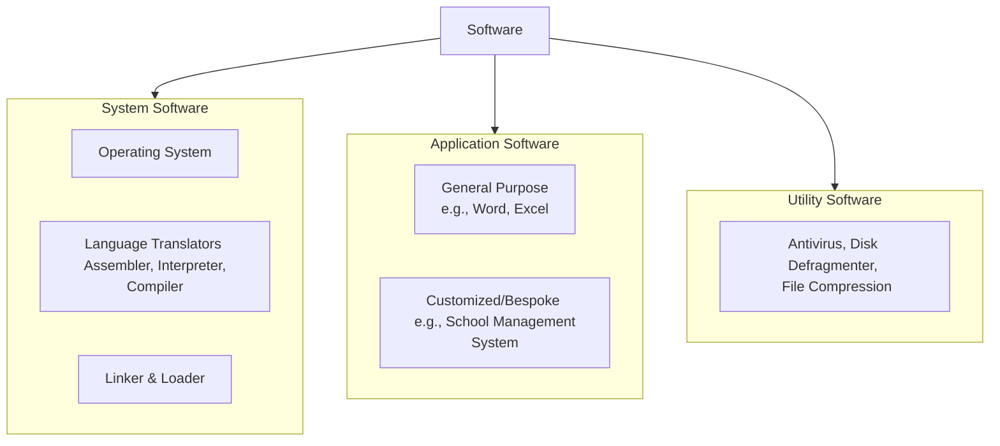
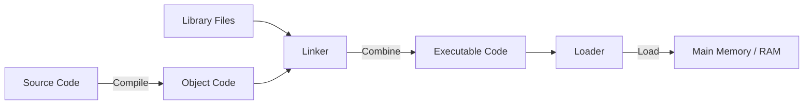

# Concepts of Software

## Part 1: Introduction to Software

A computer system consists of hardware (physical components) and software. Hardware alone cannot perform any task. Software provides the necessary instructions to make the hardware functional.

*   **Definition of Software:** Software is a collection of programs, procedures, and documentation that tells a computer system how to perform specific tasks and guides the hardware on what to do.
*   **Program:** A set of logical instructions written in a programming language to solve a specific problem or perform a task.

---

## Part 2: System Software

**System Software** is a set of one or more programs designed to control, operate, and extend the processing capabilities of the computer hardware. It acts as an interface between the user/application software and the computer hardware.

### 2.1 Language Translators
Computers only understand machine language (binary: 0s and 1s). However, programmers write programs in assembly or high-level programming languages. Language translators convert these user-written programs into machine-understandable code.

*   **Assembler:**
    *   Translates low-level **Assembly Language** programs (which use mnemonic codes like `ADD`, `SUB`, `MOV`) into machine code (binary).
*   **Compiler:**
    *   Translates a high-level language program (like C++, Java, or Python) into machine code.
    *   It translates the **entire** source code at once.
    *   It generates an intermediate object file and reports all syntax errors at the end of compilation.
*   **Interpreter:**
    *   Translates high-level code into machine code **line-by-line**.
    *   It translates a line, executes it immediately, and then moves to the next line.
    *   If an error is encountered, execution stops immediately, making debugging easier.

#### Comparison: Compiler vs. Interpreter

| Feature | Compiler | Interpreter |
| :--- | :--- | :--- |
| **Execution Speed** | Faster, as the entire code is translated once into executable binary. | Slower, as translation happens line-by-line during runtime. |
| **Error Detection** | Lists all syntax errors at the end of compilation. | Stops execution on the first error encountered. |
| **Intermediate Code** | Generates an intermediate object code file (e.g., `.obj` or `.exe`). | Does not generate any permanent intermediate object files. |
| **Memory Usage** | Requires more memory to store object code. | More memory-efficient during translation. |
| **Examples** | C, C++, Rust compilers. | Python, JavaScript, Ruby interpreters. |

---

### 2.2 Linker and Loader
To make a compiled program ready for execution, it must go through linking and loading phases.

*   **Linker:**
    *   A system program that combines different object modules or libraries generated by compilers into a single, cohesive executable file (e.g., a `.exe` file).
    *   It resolves external references (functions or variables imported from other libraries/files).
*   **Loader:**
    *   A system program that takes the executable code from secondary storage (like a hard disk) and loads it into primary memory (RAM) for execution by the CPU.
    *   It allocates physical memory space to the program and registers it with the OS.

#### Comparison: Linker vs. Loader

| Feature | Linker | Loader |
| :--- | :--- | :--- |
| **Primary Task** | Combines object files and libraries into an executable. | Loads the executable file into primary memory (RAM). |
| **Input** | Object code generated by compilers/assemblers. | Executable file generated by linkers. |
| **Output** | Executable file (`.exe`, `.bin`). | Program active in memory, ready to run. |

---

### 2.3 Operating System (OS)
An **Operating System (OS)** is a system software program that acts as an intermediary interface between the computer hardware and the user/application software. It manages the computer's resources (CPU, memory, storage, and I/O devices).

#### Primary Functions of an Operating System:
1.  **Processor Management (CPU Scheduling):** Allocates the CPU's processing power to different active tasks and processes.
2.  **Memory Management:** Tracks and controls the allocation and deallocation of primary memory (RAM) for various running programs.
3.  **File Management:** Organizes and tracks files, directories, and storage access permissions.
4.  **Device Management:** Coordinates communication between the system and external peripherals (keyboards, printers, drives) via device drivers.
5.  **User Interface (UI):** Provides a platform (GUI or CUI) for users to interact with the hardware.
6.  **Security and Error Detection:** Prevents unauthorized access using passwords/permissions, and detects hardware or software faults.

---

### 2.4 Types of Operating Systems

*   **Single-User Operating System:**
    *   Designed to manage the computer so that **one user** can effectively do one thing at a time.
    *   *Single-Tasking:* Only one program can run at a time (e.g., MS-DOS).
    *   *Multi-Tasking:* One user can run multiple programs concurrently (e.g., Windows 10/11, macOS).
*   **Multi-User Operating System:**
    *   Allows **multiple users** on different terminals to access a single central computer system and share its resources concurrently (e.g., Linux, Unix, Windows Server).
*   **Multiprogramming Operating System:**
    *   The capability of an OS to execute multiple programs concurrently on a single CPU.
    *   While one program is waiting for an I/O operation (like printing or reading from disk), the CPU switches to execute another program. This maximizes CPU utilization.
*   **Multiprocessing Operating System:**
    *   An OS that coordinates and supports the use of **two or more physical processors (CPUs)** within a single computer system.
    *   Tasks are distributed across multiple processors to run truly parallel, vastly increasing system performance (e.g., modern Windows, Linux, Android systems running on multi-core processors).
*   **Time-Sharing Operating System:**
    *   An extension of multiprogramming. Multiple users access the central system through terminals.
    *   The CPU allocates a small slice of time (called a **Time Slice** or **Quantum**) to each user. The switching happens so rapidly (in milliseconds) that each user gets the illusion that they are the sole user of the system.

---

## Part 3: Application Software

**Application Software** is a program or a set of programs written to help users perform specific tasks (such as writing a letter, drawing a picture, creating a spreadsheet, or editing photos). It cannot run without the system software.

*   **General Purpose Application Software:**
    *   Developed to meet the general needs of a wide range of users.
    *   *Examples:* Word Processors (Microsoft Word, Google Docs), Spreadsheets (Microsoft Excel, Google Sheets), Presentation tools (PowerPoint).
*   **Customized (Tailor-made / Bespoke) Application Software:**
    *   Specially developed to meet the precise, custom requirements of a specific organization, business, or individual.
    *   *Examples:* School Management Systems, Bank Transaction Portals, Inventory Control Software for a specific retail store, Railway Reservation Systems.

---

## Part 4: Utility Software

**Utility Software** consists of service programs designed to analyze, configure, optimize, and maintain a computer system. They protect the system, improve execution efficiency, or assist with system housekeeping tasks.

*   **Antivirus Software:** Scans, detects, and removes malicious software (malware, viruses, spyware) to keep the system secure (e.g., Windows Defender, Quick Heal, Norton).
*   **Disk Defragmenter:** Rearranges fragmented files stored on a magnetic hard disk so they occupy contiguous storage spaces, which speeds up file access time.
*   **File Compression Utilities:** Reduces the storage size of files or folders using compression algorithms, making them easier to store and transfer (e.g., WinZip, WinRAR, 7-Zip).
*   **Backup Utility:** Helps users create a safe copy of important system or personal data to external drives or cloud storage, allowing recovery in case of system failure.

---

## Part 5: Concepts of GUI and CUI

The interface defines how a user interacts with the operating system and applications.

*   **Character User Interface (CUI) / Command-Line Interface (CLI):**
    *   The user interacts with the system exclusively by **typing commands** through a keyboard.
    *   There are no graphics, icons, or mouse pointers; only text is displayed.
    *   It requires the user to memorize exact commands and their syntax.
    *   *Examples:* MS-DOS, Linux Terminal, Windows Command Prompt.
*   **Graphical User Interface (GUI):**
    *   The user interacts with the system using **visual elements** such as icons, windows, menus, and dialog boxes.
    *   It relies heavily on pointing devices (like a mouse, trackpad, or touchscreen).
    *   Highly user-friendly and requires very little memorization.
    *   *Examples:* Windows 11, macOS, Android, Linux (using desktop environments like GNOME or KDE).

#### Comparison: GUI vs. CUI

| Feature | Graphical User Interface (GUI) | Character User Interface (CUI) |
| :--- | :--- | :--- |
| **Primary Interaction** | Uses visual icons, windows, and mouse clicks. | Uses typed text commands. |
| **Input Device** | Keyboard, Mouse, Touchscreen. | Keyboard only. |
| **Ease of Use** | Very high, intuitive for beginners. | Difficult for beginners; requires memorization. |
| **Speed of Operation** | Slower for advanced tasks due to multiple menu clicks. | Very fast for advanced users using direct scripts/commands. |
| **Resource Usage** | High memory and graphics card requirements. | Extremely low memory and CPU requirements. |

---

## Part 6: Basic Linux Commands (CUI Examples)

Linux is a powerful, open-source multi-user operating system. It features robust GUI desktop environments, but its core strength lies in its CUI shell/terminal.

Below are the fundamental Linux commands used to interact with the file system:

| Command | Full Form / Concept | Syntax | Purpose / Action | Example |
| :--- | :--- | :--- | :--- | :--- |
| `pwd` | **P**rint **W**orking **D**irectory | `pwd` | Displays the absolute directory path of the current folder you are in. | `pwd` |
| `ls` | **L**i**s**t | `ls [options]` | Lists files and directories inside the current or specified folder. | `ls -la` (lists all hidden files too) |
| `cd` | **C**hange **D**irectory | `cd [directory_name]` | Changes the current working directory to a specified path. | `cd Documents` |
| `mkdir` | **M**a**k**e **D**irectory | `mkdir [directory_name]` | Creates a new empty folder/directory. | `mkdir Class11Notes` |
| `rmdir` | **R**e**m**ove **D**irectory | `rmdir [directory_name]` | Deletes an empty directory. | `rmdir Class11Notes` |
| `touch` | Create File | `touch [filename]` | Creates an empty file or updates the timestamp of an existing file. | `touch notes.txt` |
| `cat` | Con**cat**enate | `cat [filename]` | Displays the text contents of a file on the terminal screen. | `cat notes.txt` |
| `cp` | **C**o**p**y | `cp [source] [destination]` | Copies files or directories from one location to another. | `cp notes.txt backup/` |
| `mv` | **M**o**v**e / Rename | `mv [source] [destination]` | Moves files/folders, or renames them if the path is identical. | `mv notes.txt study.txt` |
| `rm` | **R**e**m**ove | `rm [filename]` | Deletes files permanently. | `rm study.txt` |
| `clear` | Clear Screen | `clear` | Clears all text from the active terminal window, leaving a clean prompt. | `clear` |
| `whoami` | Who Am I | `whoami` | Displays the username of the active logged-in user on the shell. | `whoami` |

---

## Quick Assessment / Review Questions

1.  **If python runs interpreter line-by-line, why do some files have a `.pyc` compiled bytecode?**
    *   *Answer:* Python uses a hybrid approach. It first compiles high-level code into intermediate bytecode (making files like `.pyc`), which is then interpreted line-by-line by the Python Virtual Machine (PVM).
2.  **What is the logical difference between Multiprogramming and Multiprocessing?**
    *   *Answer:* Multiprogramming runs multiple programs concurrently on a **single CPU** by switching tasks dynamically during idle times. Multiprocessing executes programs concurrently using **multiple physical CPUs**, allowing true parallel processing.
3.  **Why do system administrators prefer a CUI terminal to manage remote servers instead of GUI-based remote screens?**
    *   *Answer:* CUI uses significantly less bandwidth, executes commands much faster, does not waste server resources running visual UI rendering engines, and allows for easy scripting/automation of administrative tasks.