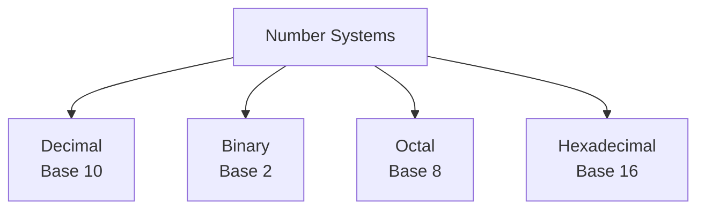
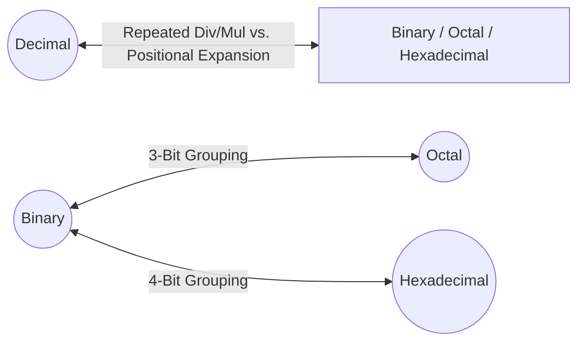
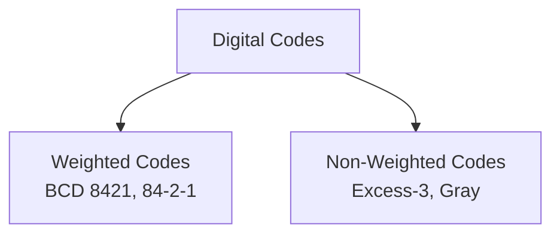
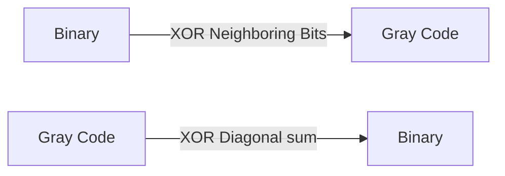
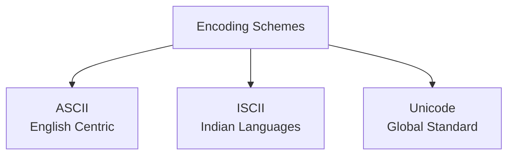

# Number Systems and Binary Codes

## Part 1: Introduction to Number Systems

A **Number System** is a mathematical way of representing numbers using a specific set of symbols (digits). The total number of unique digits used in a number system is called its **Base** or **Radix**.

### 1.1 The Four Primary Number Systems

| Number System | Base (Radix) | Allowed Digits / Symbols | Example |
| :--- | :---: | :--- | :--- |
| **Binary** | 2 | `0, 1` | $(1101.11)_2$ |
| **Octal** | 8 | `0, 1, 2, 3, 4, 5, 6, 7` | $(347.2)_8$ |
| **Decimal** | 10 | `0, 1, 2, 3, 4, 5, 6, 7, 8, 9` | $(294.5)_{10}$ |
| **Hexadecimal** | 16 | `0-9` and `A, B, C, D, E, F` (where A=10, B=11, C=12, D=13, E=14, F=15) | $(2B.F)_{16}$ |

---

## Part 2: Number System Conversions

### 2.1 Decimal to Other Bases (Binary, Octal, Hexadecimal)
*   **Integer Part:** Divide the decimal number repeatedly by the target base ($2, 8, \text{or } 16$) and record the remainders from bottom to top (Most Significant Digit to Least Significant Digit).
*   **Fractional Part:** Multiply the fractional part repeatedly by the target base, recording the integer carry from top to bottom.

#### Example: Convert $(43.625)_{10}$ to Binary
1.  **Integer Part (43):**
    *   $43 \div 2 = 21$ with Remainder = **1** (LSB)
    *   $21 \div 2 = 10$ with Remainder = **1**
    *   $10 \div 2 = 5$ with Remainder = **0**
    *   $5 \div 2 = 2$ with Remainder = **1**
    *   $2 \div 2 = 1$ with Remainder = **0**
    *   $1 \div 2 = 0$ with Remainder = **1** (MSB)
    *   Reading remainders from bottom to top: $(101011)_2$
2.  **Fractional Part (0.625):**
    *   $0.625 \times 2 = \mathbf{1}.250 \rightarrow$ Carry **1**
    *   $0.250 \times 2 = \mathbf{0}.500 \rightarrow$ Carry **0**
    *   $0.500 \times 2 = \mathbf{1}.000 \rightarrow$ Carry **1** (Stop as fractional part becomes .000)
    *   Reading carries from top to bottom: $(.101)_2$

**Result:** $(43.625)_{10} = (101011.101)_2$

---

### 2.2 Other Bases to Decimal
Multiply each digit of the given number by its positional weight (Base raised to its power) and sum the results.

$$\text{Weight} = \text{Base}^{\text{Position}}$$

#### Example: Convert $(2A.C)_{16}$ to Decimal
*   $2 \times 16^1 + A \times 16^0 + C \times 16^{-1}$
*   $= (2 \times 16) + (10 \times 1) + (12 \times 0.0625)$
*   $= 32 + 10 + 0.75$
*   $= (42.75)_{10}$

---

### 2.3 Binary to Octal / Hexadecimal (and Vice Versa)
Since $8 = 2^3$ and $16 = 2^4$, we can convert between binary and these bases by grouping bits.

#### A. Binary to Octal (Group of 3 bits)
Group binary bits into sets of 3, starting from the binary point moving left for integers, and right for fractions. Pad with zeros if necessary.
*   **Example:** $(1101011.1)_2 \rightarrow (\underline{001}\ \underline{101}\ \underline{011}\ .\ \underline{100})_2$
*   Convert each group: $001 = 1$, $101 = 5$, $011 = 3$, $100 = 4$
*   **Result:** $(153.4)_8$

#### B. Binary to Hexadecimal (Group of 4 bits)
Group binary bits into sets of 4.
*   **Example:** $(1101011.1)_2 \rightarrow (\underline{0110}\ \underline{1011}\ .\ \underline{1000})_2$
*   Convert each group: $0110 = 6$, $1011 = 11\ (\text{or } B)$, $1000 = 8$
*   **Result:** $(6B.8)_{16}$

#### C. Octal / Hexadecimal to Binary
Simply replace each digit with its 3-bit (for Octal) or 4-bit (for Hexadecimal) binary equivalent.
*   **Example:** $(35.6)_8 \rightarrow 3 = 011,\ 5 = 101,\ 6 = 110 \rightarrow (011101.110)_2$

---

## Part 3: Signed Binary Numbers & Complements

To store negative integers in hardware, computer processors use complement arithmetic.

### 3.1 1's Complement
*   **Method:** Invert all bits of the binary number (change `0` to `1` and `1` to `0`).
*   **Example:** Find the 1's complement of $101101$:
    *   Original: `1 0 1 1 0 1`
    *   1's Complement: `0 1 0 0 1 0`

### 3.2 2's Complement
*   **Method:** Find the 1's complement of the number, and then add `1` to the Least Significant Bit (LSB).
    $$\text{2's Complement} = \text{1's Complement} + 1$$

#### Example: Find the 2's complement of $101100$
1.  Find 1's complement of $101100$: `010011`
2.  Add $1$ to LSB:
    $$\begin{array}{r@{\quad}l}
    010011 \\
    +\quad\quad\ 1 \\
    \hline
    010100
    \end{array}$$

#### Hardware Shortcut for 2's Complement:
Reading from right to left (LSB to MSB):
1.  Copy all bits up to and including the first `1`.
2.  Invert all subsequent remaining bits.
*   *Example:* For `101100`, copying up to the first `1` yields `100`. Inverting the rest (`101`) yields `010`. Combining them gives `010100`.

---

## Part 4: Binary Codes

Computers use binary codes to represent decimal digits, characters, and commands.

### 4.1 Weighted Codes
In weighted codes, each bit position is assigned a specific numerical value (weight). The decimal value is computed by adding the weights of all positions that contain a `1`.

#### A. BCD (Binary Coded Decimal / 8421 Code)
*   Each decimal digit ($0 \text{ to } 9$) is represented by its standard 4-bit binary equivalent.
*   **Weights:** $8, 4, 2, 1$.
*   Since 4 bits can represent 16 states ($0-15$), the combinations from $1010$ to $1111$ ($10$ to $15$) are **invalid / forbidden** in BCD.
*   **Example:** Represent $(39)_{10}$ in BCD:
    *   $3 \rightarrow 0011$
    *   $9 \rightarrow 1001$
    *   $(39)_{10} = (0011\ 1001)_{\text{BCD}}$

#### B. 84-2-1 Code (Self-Complementing Negative Weighted Code)
*   Uses weights that can be negative: $8, 4, -2, -1$.
*   It is a **self-complementing code** because the sum of its weights equals $9$ ($8+4-2-1=9$). The 1's complement of its binary representation equals the 9's complement of its decimal value.

---

### 4.2 Non-Weighted Codes
In non-weighted codes, bits do not have fixed positional values.

#### A. Excess-3 Code
*   **Method:** Add decimal $3$ ($0011$ in binary) to each BCD digit of a number.
*   It is a self-complementing code.
*   **Example:** Convert $(4)_{10}$ to Excess-3:
    *   $\text{BCD of } 4 = 0100$
    *   $\text{Add } 3 \rightarrow 0100 + 0011 = 0111$
    *   $(4)_{10} = (0111)_{\text{XS-3}}$

#### B. Gray Code (Unit-Distance / Cyclic Code)
*   Only **one bit changes** when transitioning from one number to the next.
*   Used in rotary encoders and error correction to prevent transient errors during state transitions.

#### 1. Binary to Gray Code Conversion:
*   Keep the Most Significant Bit (MSB) unchanged.
*   Perform an **XOR** (Exclusive OR) operation on each adjacent pair of binary bits to determine the next Gray bit.
    $$\text{XOR Rules: } 0 \oplus 0 = 0,\ 1 \oplus 1 = 0,\ 0 \oplus 1 = 1,\ 1 \oplus 0 = 1$$

*   **Example:** Convert Binary `1011` to Gray:
    *   $G_3 = B_3 = \mathbf{1}$
    *   $G_2 = B_3 \oplus B_2 = 1 \oplus 0 = \mathbf{1}$
    *   $G_1 = B_2 \oplus B_1 = 0 \oplus 1 = \mathbf{1}$
    *   $G_0 = B_1 \oplus B_0 = 1 \oplus 1 = \mathbf{0}$
    *   **Gray Code:** `1110`

#### 2. Gray to Binary Code Conversion:
*   Keep the MSB unchanged.
*   XOR the generated binary bit with the next adjacent Gray bit.
*   **Example:** Convert Gray `1110` to Binary:
    *   $B_3 = G_3 = \mathbf{1}$
    *   $B_2 = B_3 \oplus G_2 = 1 \oplus 1 = \mathbf{0}$
    *   $B_1 = B_2 \oplus G_1 = 0 \oplus 1 = \mathbf{1}$
    *   $B_0 = B_1 \oplus G_0 = 1 \oplus 0 = \mathbf{1}$
    *   **Binary Code:** `1011`

---

### 4.3 Summary Code Conversion Table ($0$ to $9$)

| Decimal Digit | 8421 (BCD) | 84-2-1 | Excess-3 | Gray Code |
| :---: | :---: | :---: | :---: | :---: |
| **0** | `0000` | `0000` | `0011` | `0000` |
| **1** | `0001` | `0111` | `0100` | `0001` |
| **2** | `0010` | `0110` | `0101` | `0011` |
| **3** | `0011` | `0101` | `0110` | `0010` |
| **4** | `0100` | `0100` | `0111` | `0110` |
| **5** | `0101` | `1011` | `1000` | `0111` |
| **6** | `0110` | `1010` | `1001` | `0101` |
| **7** | `0111` | `1001` | `1010` | `0100` |
| **8** | `1000` | `1000` | `1011` | `1100` |
| **9** | `1001` | `1111` | `1100` | `1101` |

---

## Part 5: Alphanumeric Encoding Schemes

Since computers process non-numeric characters (letters, punctuation), coding systems assign a unique binary integer to every character.

### 5.1 ASCII (American Standard Code for Information Interchange)
*   **Characteristics:**
    *   Developed primarily for the English language.
    *   **7-Bit ASCII:** Defines $2^7 = 128$ unique characters (values $0 \text{ to } 127$). Covers uppercase and lowercase English letters, digits, punctuation, and control characters (like Backspace, Enter).
    *   **8-Bit Extended ASCII:** Defines $2^8 = 256$ unique characters to include basic mathematical symbols and some European characters.
*   *Key values to remember:*
    *   `'A'` = $65 \rightarrow (01000001)_2$
    *   `'a'` = $97 \rightarrow (01100001)_2$
    *   `'0'` = $48 \rightarrow (00110000)_2$

### 5.2 ISCII (Indian Script Code for Information Interchange)
*   **Characteristics:**
    *   An **8-bit** coding system ($256$ unique code slots) designed specifically to represent Indian languages and writing scripts.
    *   Supports Devanagari, Bengali, Gurmukhi, Gujarati, Oriya, Tamil, Telugu, Kannada, Malayalam, and Assamese.
    *   Keeps the first 128 characters identical to English ASCII, utilizing the remaining higher 128 positions for Indian alphabetic characters.

### 5.3 Unicode (Universal Character Encoding Standard)
*   **Why it was needed:** ASCII and ISCII are limited by their small bit sizes and cannot represent all global languages (such as Chinese, Japanese, Korean, Arabic) simultaneously.
*   **Characteristics:**
    *   A universal standard capable of representing **every character in every written language on Earth**, including historical scripts and emojis.
    *   **Common Formats:**
        *   **UTF-8:** A variable-width encoding (uses 1 to 4 bytes). It is backward-compatible with ASCII (English letters use 1 byte, while other language characters use more). This makes it the dominant encoding standard for the World Wide Web.
        *   **UTF-16:** Uses 2 or 4 bytes per character.
        *   **UTF-32:** Uses a fixed 4 bytes (32 bits) for every single character. Highly inefficient for storage but simple to process.

---

## Quick Assessment / Review Questions

1.  **Convert $(1011)_{2}$ to Gray code.**
    *   *Answer:* MSB remains `1`. First XOR: $1 \oplus 0 = 1$. Second XOR: $0 \oplus 1 = 1$. Third XOR: $1 \oplus 1 = 0$. Gray code = `1110`.
2.  **What is the advantage of Excess-3 code over BCD (8421)?**
    *   *Answer:* Excess-3 is a self-complementing code. This allows digital adder circuits to perform subtraction using simple 1's complement addition techniques, simplifying system hardware design.
3.  **Why is UTF-8 preferred over UTF-32 for web pages?**
    *   *Answer:* UTF-8 is a variable-width encoding. English text characters are represented using a single byte (8 bits), saving substantial storage space and network bandwidth compared to the fixed 4 bytes (32 bits) required by UTF-32.
4.  **Find the 2's complement of the binary value `110100`.**
    *   *Answer:* Write down digits from right to left up to the first `1`: `00` followed by `1`. Invert the remaining three bits (`110` becomes `001`). Combined result = `001100`.