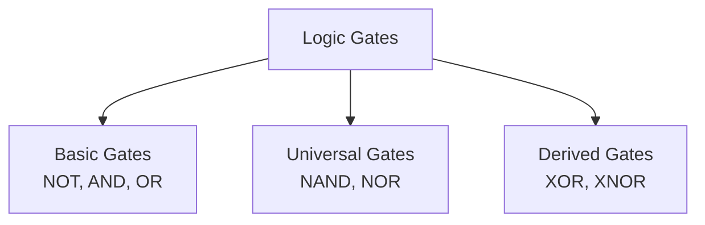
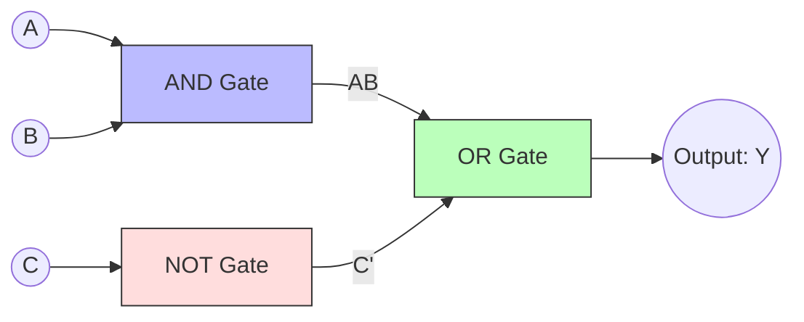

# Boolean Algebra

## Part 1: Postulates and Laws of Boolean Algebra

Boolean algebra is a system of mathematical logic that deals with binary-valued variables (which can only have two states: `0` / **False** or `1` / **True**).

### 1.1 Fundamental Postulates (Axioms)
These are basic assumptions in Boolean algebra that do not require proof:

1.  **Closure:** The result of any Boolean operation (AND, OR, NOT) is always a binary value (either `0` or `1`).
2.  **Identity Elements:**
    *   `0` is the identity element for OR ($+$): $A + 0 = A$
    *   `1` is the identity element for AND ($\cdot$): $A \cdot 1 = A$
3.  **Commutative Law:**
    *   $A + B = B + A$
    *   $A \cdot B = B \cdot A$
4.  **Distributive Law:**
    *   $A \cdot (B + C) = (A \cdot B) + (A \cdot C)$
    *   $A + (B \cdot C) = (A + B) \cdot (A + C)$ *(Unlike ordinary algebra)*
5.  **Complement Law:** For every variable $A$, there exists a complement $\overline{A}$ (or $A'$) such that:
    *   $A + \overline{A} = 1$
    *   $A \cdot \overline{A} = 0$

---

### 1.2 The Duality Principle
The **Duality Principle** states that any true Boolean relation remains true if:
1.  All **AND** ($\cdot$) operators are replaced with **OR** ($+$) operators.
2.  All **OR** ($+$) operators are replaced with **AND** ($\cdot$) operators.
3.  All `0`s are replaced with `1`s, and all `1`s are replaced with `0`s.
*(Note: Variables themselves are NOT complemented during dual conversion).*

*   *Example:* The dual of the relation $A + (B \cdot C) = (A + B) \cdot (A + C)$ is $A \cdot (B + C) = (A \cdot B) + (A \cdot C)$.

---

### 1.3 Key Boolean Theorems and Laws

| Law Name | OR Version ($+$) | AND Version ($\cdot$) |
| :--- | :--- | :--- |
| **Properties of 0 and 1** | $A + 1 = 1$ | $A \cdot 0 = 0$ |
| **Idempotence Law** | $A + A = A$ | $A \cdot A = A$ |
| **Involution (Double Complement)** | $\overline{\overline{A}} = A$ | — |
| **Associative Law** | $(A + B) + C = A + (B + C)$ | $(A \cdot B) \cdot C = A \cdot (B \cdot C)$ |
| **Absorption Law** | $A + (A \cdot B) = A$ | $A \cdot (A + B) = A$ |
| **Consensus Law** | $AB + \overline{A}C + BC = AB + \overline{A}C$ | $(A+B)(\overline{A}+C)(B+C) = (A+B)(\overline{A}+C)$ |

---

## Part 2: Logic Gates and Truth Tables

Logic gates are the physical building blocks of digital electronic circuits. They process one or more binary inputs to produce a single binary output.

### 2.1 Basic Logic Gates

#### A. NOT Gate (Inverter)
Inverts the input signal.
*   **Boolean Expression:** $Y = \overline{A}$
*   **Truth Table:**

| Input ($A$) | Output ($Y$) |
| :---: | :---: |
| 0 | 1 |
| 1 | 0 |

#### B. AND Gate
Outputs `1` only if **all** inputs are `1`.
*   **Boolean Expression:** $Y = A \cdot B$ (or $Y = AB$)
*   **Truth Table:**

| $A$ | $B$ | $Y = A \cdot B$ |
| :---: | :---: | :---: |
| 0 | 0 | 0 |
| 0 | 1 | 0 |
| 1 | 0 | 0 |
| 1 | 1 | 1 |

#### C. OR Gate
Outputs `1` if **at least one** input is `1`.
*   **Boolean Expression:** $Y = A + B$
*   **Truth Table:**

| $A$ | $B$ | $Y = A + B$ |
| :---: | :---: | :---: |
| 0 | 0 | 0 |
| 0 | 1 | 1 |
| 1 | 0 | 1 |
| 1 | 1 | 1 |

---

### 2.2 Universal Logic Gates
NAND and NOR gates are called **Universal Gates** because any Boolean expression or basic gate can be realized using only these gates.

#### A. NAND Gate (NOT-AND)
Outputs `0` only if **all** inputs are `1`. It is the complement of an AND gate.
*   **Boolean Expression:** $Y = \overline{A \cdot B}$
*   **Truth Table:**

| $A$ | $B$ | $Y = \overline{AB}$ |
| :---: | :---: | :---: |
| 0 | 0 | 1 |
| 0 | 1 | 1 |
| 1 | 0 | 1 |
| 1 | 1 | 0 |

#### B. NOR Gate (NOT-OR)
Outputs `1` only if **all** inputs are `0`. It is the complement of an OR gate.
*   **Boolean Expression:** $Y = \overline{A + B}$
*   **Truth Table:**

| $A$ | $B$ | $Y = \overline{A+B}$ |
| :---: | :---: | :---: |
| 0 | 0 | 1 |
| 0 | 1 | 0 |
| 1 | 0 | 0 |
| 1 | 1 | 0 |

---

### 2.3 Derived Logic Gates

#### A. XOR Gate (Exclusive OR)
Outputs `1` if the inputs are **different** (odd number of ones).
*   **Boolean Expression:** $Y = A \oplus B = \overline{A}B + A\overline{B}$
*   **Truth Table:**

| $A$ | $B$ | $Y = A \oplus B$ |
| :---: | :---: | :---: |
| 0 | 0 | 0 |
| 0 | 1 | 1 |
| 1 | 0 | 1 |
| 1 | 1 | 0 |

#### B. XNOR Gate (Exclusive NOR)
Outputs `1` if the inputs are **identical** (even number of ones). It is the complement of an XOR gate.
*   **Boolean Expression:** $Y = A \odot B = AB + \overline{A}\cdot\overline{B}$
*   **Truth Table:**

| $A$ | $B$ | $Y = A \odot B$ |
| :---: | :---: | :---: |
| 0 | 0 | 1 |
| 0 | 1 | 0 |
| 1 | 0 | 0 |
| 1 | 1 | 1 |

---

## Part 3: De Morgan’s Theorems

De Morgan's Theorems provide a mathematical way to simplify the complements of grouped logical expressions.

### 3.1 First Theorem
The complement of a sum (OR) of variables is equal to the product (AND) of their individual complements.
$$\overline{A + B} = \overline{A} \cdot \overline{B}$$

### 3.2 Second Theorem
The complement of a product (AND) of variables is equal to the sum (OR) of their individual complements.
$$\overline{A \cdot B} = \overline{A} + \overline{B}$$

### 3.3 Proof of De Morgan's Laws using a Truth Table

| $A$ | $B$ | $A+B$ | $\overline{A+B}$ | $A\cdot B$ | $\overline{A\cdot B}$ | $\overline{A}$ | $\overline{B}$ | $\overline{A}\cdot\overline{B}$ | $\overline{A}+\overline{B}$ |
| :---: | :---: | :---: | :---: | :---: | :---: | :---: | :---: | :---: | :---: |
| 0 | 0 | 0 | **1** | 0 | **1** | 1 | 1 | **1** | **1** |
| 0 | 1 | 1 | **0** | 0 | **1** | 1 | 0 | **0** | **1** |
| 1 | 0 | 1 | **0** | 0 | **1** | 0 | 1 | **0** | **1** |
| 1 | 1 | 1 | **0** | 1 | **0** | 0 | 0 | **0** | **0** |

*   Column $\overline{A+B}$ is identical to Column $\overline{A}\cdot\overline{B}$, proving the **First Theorem** [14, 29].
*   Column $\overline{A\cdot B}$ is identical to Column $\overline{A}+\overline{B}$, proving the **Second Theorem** [14, 29].

---

## Part 4: Canonical Forms (SOP and POS)

Any Boolean function can be expressed in canonical (standardized) forms based on **Minterms** and **Maxterms**.

*   **Minterm:** A product (AND) of all variables in the function, either in direct or complemented form. A minterm represents a output state of `1`.
*   **Maxterm:** A sum (OR) of all variables in the function, either in direct or complemented form. A maxterm represents a output state of `0`.

### 4.1 Sum of Products (SOP) Form
*   An expression consisting of the logical OR of multiple minterms.
*   **Represented by:** $\sum$ (sigma) symbol.
*   *Variable Rule:* A variable is written as **normal ($A$) if it is `1`**, and as **complemented ($\overline{A}$) if it is `0`**.
*   *Example:* For $A=1, B=0, C=1$, the minterm ($m_5$) is $A\overline{B}C$.

### 4.2 Product of Sums (POS) Form
*   An expression consisting of the logical AND of multiple maxterms.
*   **Represented by:** $\prod$ (pi) symbol.
*   *Variable Rule:* A variable is written as **normal ($A$) if it is `0`**, and as **complemented ($\overline{A}$) if it is `1`**.
*   *Example:* For $A=1, B=0, C=1$, the maxterm ($M_5$) is $\overline{A} + B + \overline{C}$.

#### SOP vs. POS Summary

| Feature | Sum of Products (SOP) | Product of Sums (POS) |
| :--- | :--- | :--- |
| **Operation Sequence** | AND terms are ORed together. | OR terms are ANDed together. |
| **Logic State Focus** | Maps inputs where the output is **`1`**. | Maps inputs where the output is **`0`**. |
| **Representation** | $F(A,B,C) = \sum m(1, 3, 5)$ | $F(A,B,C) = \prod M(0, 2, 4, 6, 7)$ |
| **Example Expression** | $Y = AB\overline{C} + \overline{A}BC$ | $Y = (A+B+C)(\overline{A}+\overline{B}+C)$ |

---

## Part 5: Simplification of Boolean Expressions

Simplifying Boolean functions reduces the physical gate count when building circuits, making the final hardware faster and more cost-efficient.

### 5.1 Algebraic Simplification (Using Laws)

**Example:** Simplify the Boolean function $F = AB + A(B+C) + B(B+C)$
1.  **Distribute:**  
    $F = AB + AB + AC + BB + BC$
2.  **Apply Idempotence ($AB+AB = AB$) and Property of Identity ($BB = B$):**  
    $F = AB + AC + B + BC$
3.  **Group $B$ terms:**  
    $F = AC + B(A + 1 + C)$
4.  **Apply Property of 1 ($A + 1 + C = 1$):**  
    $F = AC + B(1)$
5.  **Final Simplified Expression:**  
    $F = B + AC$

---

### 5.2 Karnaugh Map (K-Map) Simplification
A **K-Map** is a visual grid representation of a truth table. The cells are arranged using **Gray Code** ($00, 01, 11, 10$) so that adjacent cells differ by only one bit position.

#### Grouping Rules:
*   **Pair (Group of 2 adjacent cells):** Eliminates $1$ variable.
*   **Quad (Group of 4 adjacent cells):** Eliminates $2$ variables.
*   **Octet (Group of 8 adjacent cells):** Eliminates $3$ variables.
*   Groups can wrap around the edges of the map (top-to-bottom and left-to-right).

#### A. 3-Variable K-Map Structure (Variables $A$ on row, $BC$ on columns)

| | $B'C'\ (00)$ | $B'C\ (01)$ | $BC\ (11)$ | $BC'\ (10)$ |
| :--- | :---: | :---: | :---: | :---: |
| **$A'\ (0)$** | $m_0$ | $m_1$ | $m_3$ | $m_2$ |
| **$A\ (1)$** | $m_4$ | $m_5$ | $m_7$ | $m_6$ |

*(Note the column order is $00, 01, 11, 10$ due to Gray coding).*

#### B. Step-by-Step 3-Variable K-Map Optimization Example
**Problem:** Minimize the function $F(A, B, C) = \sum m(1, 3, 5, 7)$

**Step 1: Fill the K-Map with `1`s for minterms $1, 3, 5, 7$.**

| | $B'C'\ (00)$ | $B'C\ (01)$ | $BC\ (11)$ | $BC'\ (10)$ |
| :--- | :---: | :---: | :---: | :---: |
| **$A'\ (0)$** | 0 | **1** ($m_1$) | **1** ($m_3$) | 0 |
| **$A\ (1)$** | 0 | **1** ($m_5$) | **1** ($m_7$) | 0 |

**Step 2: Group the cells.**
*   We can form a **Quad (Group of 4 cells)** comprising $\{m_1, m_3, m_5, m_7\}$.

**Step 3: Eliminate changing variables.**
*   *Row-wise analysis:* $A$ changes from $0$ to $1$ across the group. Thus, $A$ is eliminated.
*   *Column-wise analysis:* The columns involved are $01$ ($B'C$) and $11$ ($BC$). $B$ changes from $0$ to $1$, so $B$ is eliminated. $C$ remains $1$ in both columns.
*   The remaining term is **$C$**.

**Result:** $F = C$

---

## Part 6: Logic Circuits

A logic circuit is a diagram that shows how logic gates connect to perform a Boolean function.

### Example Circuit Diagram
To draw the logic circuit for the expression $Y = AB + \overline{C}$:
1.  Connect $A$ and $B$ to an **AND** gate to get $AB$.
2.  Connect $C$ to a **NOT** gate to get $\overline{C}$.
3.  Connect the outputs of the AND gate and the NOT gate to an **OR** gate to get the final output $Y$.

---

## Quick Assessment / Review Questions

1.  **State why NAND is called a universal gate.**
    *   *Answer:* A NAND gate is called a universal gate because any basic logic operation (AND, OR, NOT) can be constructed using only combinations of NAND gates, without needing other types of gates.
2.  **Simplify algebraically: $A + \overline{A}B$**
    *   *Answer:* Using the Distributive Law ($X + YZ = (X+Y)(X+Z)$), we can expand:
        $A + \overline{A}B = (A + \overline{A})(A + B)$.  
        Since $A + \overline{A} = 1$, the expression simplifies to $1 \cdot (A + B) = A + B$.
3.  **State De Morgan's Second Theorem and write its Boolean equation.**
    *   *Answer:* De Morgan's Second Theorem states that the complement of a product of variables is equal to the sum of their individual complements.  
        $$\overline{A \cdot B} = \overline{A} + \overline{B}$$
4.  **In a 4-variable K-Map, how many variables are eliminated when you group a Quad (4 adjacent cells)?**
    *   *Answer:* Grouping a Quad (4 cells) eliminates $2$ variables. (Grouping a Pair eliminates $1$ variable, and grouping an Octet eliminates $3$ variables).