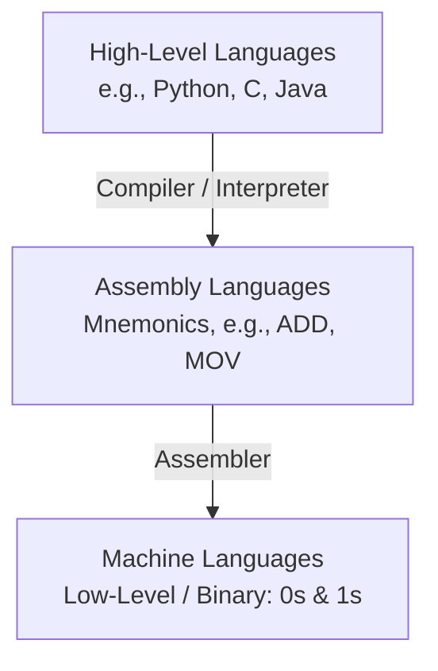
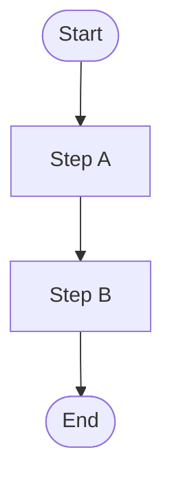
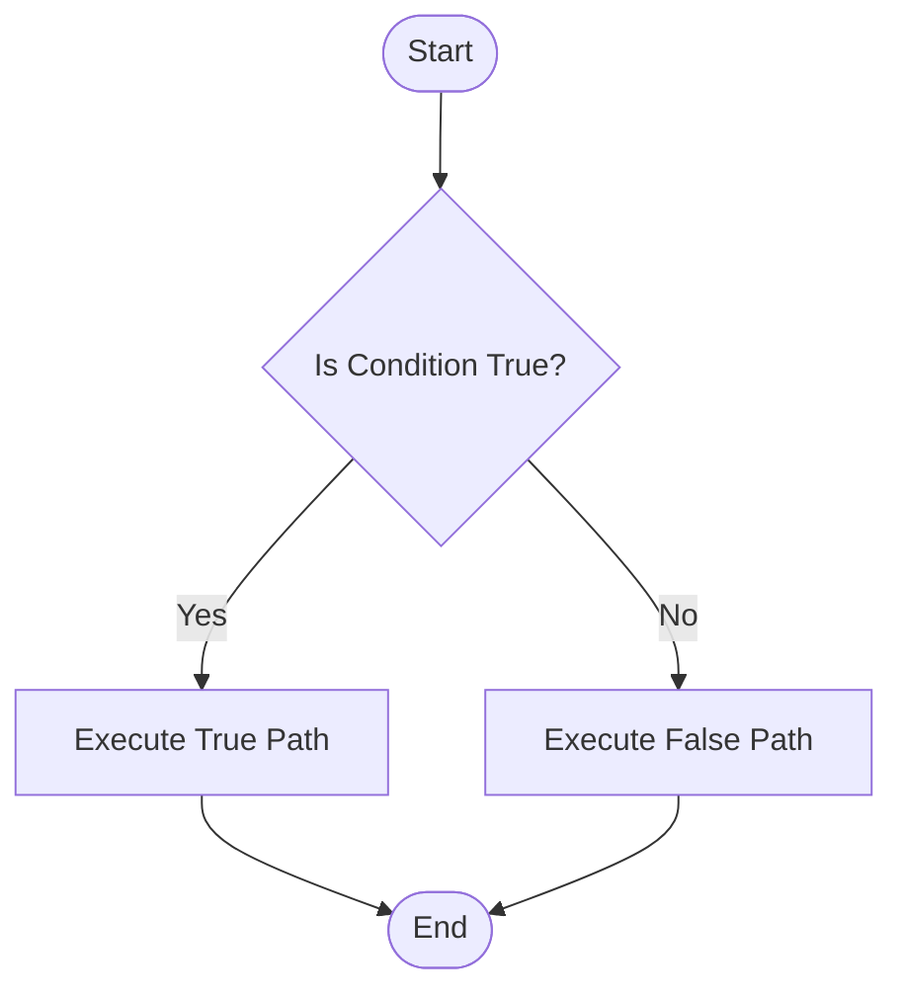
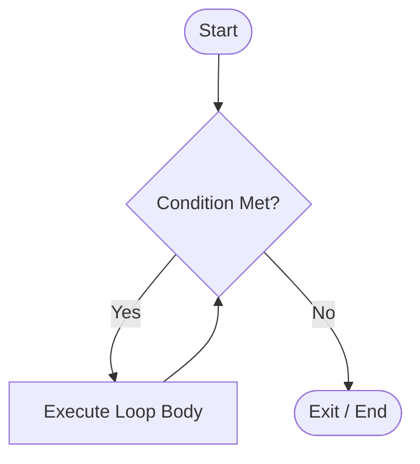
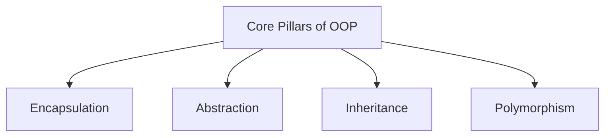

## 1. Concept of Programming
*   **What is Programming?**
    *   It is the systematic process of designing, writing, testing, debugging, and maintaining the source code of a computer program.
    *   It acts as a medium of communication between humans and computers, enabling us to instruct the computer to perform specific tasks.
    *   At its core, programming is about problem-solving and algorithm implementation.

---

## 2. Instruction and Program

### A. Instruction
*   **Definition:**
    *   An instruction is a single, basic command or directive given to a computer's processor by a program to perform a specific operation.
    *   It is the smallest unit of execution in a computer program.
*   **Structure of an Instruction:**
    *   Typically consists of two parts:
        1.  **Opcode (Operation Code):** Specifies *what* action to perform (e.g., ADD, SUB, MOV).
        2.  **Operand:** Specifies *where* the data is or *what* data to perform the action on (e.g., registers, memory addresses, or constants).
*   **Examples:**
    *   **Assembly Language:** 
        ```assembly
        ADD AX, BX  ; Adds the contents of register BX to AX
        ```
    *   **High-Level Language (Python):** 
        ```python
        x = 5 + 3  # Instructs the computer to add 5 and 3, then assign the result to x
        ```

### B. Program
*   **Definition:**
    *   A program is a structured collection of instructions written in a programming language that performs a specific task when executed by a computer.
    *   In academic terms, it is often modeled as:
        $$\text{Program} = \text{Data Structures} + \text{Algorithms}$$
*   **Example (Python):**
    ```python
    # A simple program to calculate the area of a rectangle
    length = 5.0
    width = 3.0
    area = length * width
    print("Area of rectangle:", area)
    ```
*   **Example (C):**
    ```c
    #include <stdio.h>

    int main() {
        float length = 5.0;
        float width = 3.0;
        float area = length * width;
        printf("Area of rectangle: %.2f\n", area);
        return 0;
    }
    ```

---

## 3. Programming Languages
Programming languages are categorized based on their level of abstraction from the hardware.



### A. Low-Level Languages (LLL)
Low-level languages are closely tied to the hardware architecture of the computer.

#### Machine Language (First Generation)
*   **Concept:** The only language that the CPU directly understands and executes.
*   **Format:** Written entirely in binary code (streams of $0$s and $1$s).
*   **Pros:** Fast and efficient execution with zero conversion overhead.
*   **Cons:** 
    *   Highly machine-dependent (code written for one architecture won't run on another).
    *   Difficult to write, read, debug, and maintain.

#### Assembly Language (Second Generation)
*   **Concept:** An upgrade over machine language where binary codes are replaced by human-readable abbreviations called **mnemonics**.
*   **Translator:** Needs a software called an **Assembler** to translate assembly code into machine code.
*   **Format:** Uses identifiers like `MOV`, `ADD`, `SUB`, `JMP`.
*   **Example:**
    ```assembly
    MOV AL, 61h  ; Load hex value 61 into register AL
    ```

### B. High-Level Languages (HLL) (Third Generation & Beyond)
*   **Concept:** Languages designed to be user-friendly, abstracting away the hardware details. They use English-like words and mathematical symbols.
*   **Portability:** Highly portable; the same code can run on different hardware platforms with minimal or no modification.
*   **Translators:** Requires translation into machine code using either a **Compiler** (translates the entire program at once) or an **Interpreter** (translates program line-by-line).
*   **Examples:** Python, C++, Java, C.

### Summary Comparison Table

| Feature | Machine Language | Assembly Language | High-Level Language |
| :--- | :--- | :--- | :--- |
| **Format** | Binary ($0$ and $1$) | Mnemonics (text) | English-like statements |
| **Hardware Link** | Directly tied to hardware | Closely tied to hardware | Independent of hardware |
| **Execution Speed**| Fastest | Fast | Slower (due to translation overhead) |
| **Ease of Learning**| Highly difficult | Difficult | Easy |
| **Translator** | None required | Assembler | Compiler or Interpreter |

---

## 4. Procedural vs. Non-Procedural Programming

### A. Procedural Programming
*   **Concept:** Focuses on the "how" of solving a problem. The program is structured around procedures, routines, or subroutines (functions).
*   **Execution Flow:** Follows a systematic, step-by-step top-down approach.
*   **State Management:** Highly dependent on global and local variables where states change as procedures are executed.
*   **Key Characteristics:**
    *   Heavy use of loops, conditional statements, and functions.
    *   Data and functions are separate entities.
*   **Common Languages:** C, Fortran, Pascal, COBOL.

### B. Non-Procedural (Declarative) Programming
*   **Concept:** Focuses on the "what" to achieve rather than "how" to achieve it. The user specifies the desired output, and the underlying system decides how to fetch it.
*   **Execution Flow:** Implicit; there is no rigid step-by-step instruction flow managed by the programmer.
*   **Key Characteristics:**
    *   Highly abstract and concise.
    *   Utilizes mathematical logic or database queries.
*   **Common Languages:** SQL (Structured Query Language), Prolog, LISP.
*   **Example (SQL Query vs. Procedural loop):**
    *   *Non-procedural approach:* 
        ```sql
        SELECT Name FROM Students WHERE Marks > 90;
        ```
        *(The database engine figures out how to retrieve the data; you just specify what you want).*

---

## 5. Concept of Structured Programming
*   **Definition:**
    *   A programming paradigm aimed at improving the clarity, quality, and development time of a program by making extensive use of structured control flow constructs.
    *   It discourages the use of unconditional jumps like `GOTO`, which often lead to confusing "spaghetti code."
*   **Top-Down Approach:**
    *   The overall problem is broken down into smaller sub-problems (modules), which are then solved individually.
*   **Three Basic Control Structures:**

### A. Sequence
Statements executed one after another in order.



### B. Selection (Decision)
Executing one of multiple paths based on a condition (e.g., `if-else` structures).



### C. Iteration (Looping)
Repeating a sequence of statements while a condition remains true (e.g., `for`, `while` loops).



*   **Example in Python:**
    ```python
    # Sequence
    num = 10
    
    # Selection
    if num % 2 == 0:
        print("Even")
    else:
        print("Odd")
        
    # Iteration
    for i in range(3):
        print("Value:", i)
    ```

---

## 6. Object-Oriented Programming (OOP)
*   **Concept:**
    *   A programming paradigm organized around "Objects" rather than functions or actions.
    *   It models real-world entities into software structures, binding both data and the functions that manipulate them together.



### Core Concepts of OOP

1.  **Class:**
    *   A blueprint, template, or prototype from which individual objects are created. It defines properties (attributes) and behaviors (methods).
2.  **Object:**
    *   An instance of a class. It has state (data represented by attributes) and behavior (defined by methods).
3.  **Encapsulation:**
    *   The wrapping up of data and the methods that operate on that data into a single unit (Class). 
    *   It restricts direct access to some of the object's components (data hiding).
4.  **Abstraction:**
    *   Hiding complex implementation details and showing only the essential features to the user.
5.  **Inheritance:**
    *   The mechanism by which one class (sub/child class) acquires the properties and behaviors of another class (super/parent class). This promotes code reusability.
6.  **Polymorphism:**
    *   The ability of different objects to respond to the same message/function call in different ways. (Literally means "many forms").

### OOP Example (Python)
This example highlights classes, objects, encapsulation, and inheritance:

```python
# Parent Class (Abstraction & Encapsulation)
class Animal:
    def __init__(self, name):
        self.name = name  # Attribute

    def speak(self):
        raise NotImplementedError("Subclass must implement this abstract method")

# Child Class inheriting from Animal (Inheritance)
class Dog(Animal):
    def speak(self):
        return f"{self.name} says Woof!"  # Polymorphism in action

class Cat(Animal):
    def speak(self):
        return f"{self.name} says Meow!"

# Creating instances (Objects)
dog_obj = Dog("Buddy")
cat_obj = Cat("Whiskers")

print(dog_obj.speak())  # Output: Buddy says Woof!
print(cat_obj.speak())  # Output: Whiskers says Meow!
```