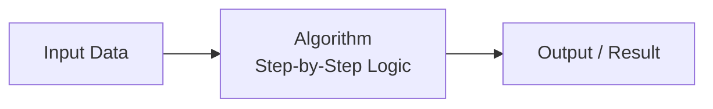
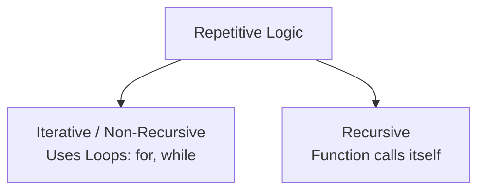
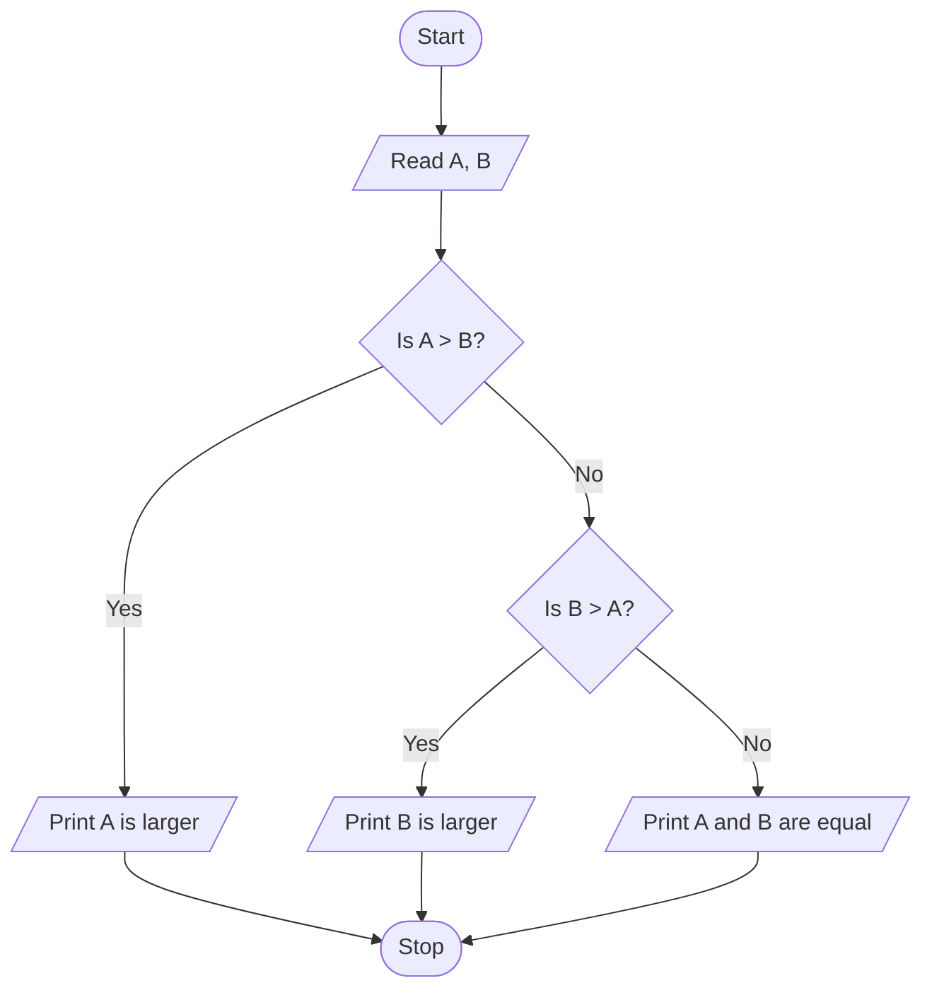
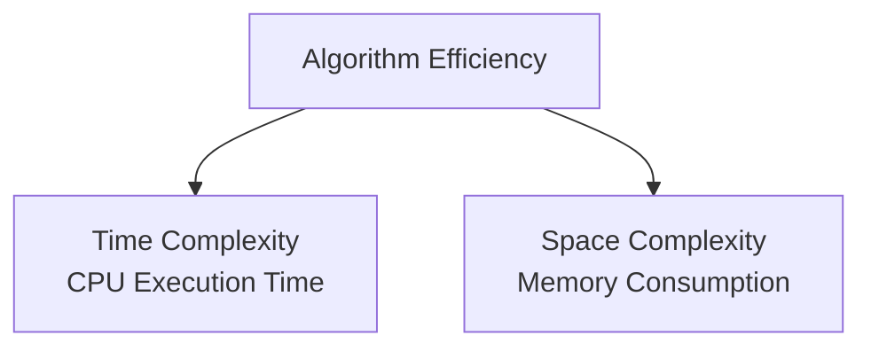
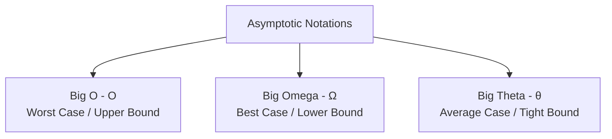

# Algorithm Fundamentals

## Part 1: Introduction to Algorithms

An **Algorithm** is a step-by-step, finite sequence of unambiguous instructions written to solve a specific computational or logical problem. It serves as the blueprint or logic behind a computer program.



### 1.1 Characteristics of an Algorithm
For a set of instructions to be classified as an algorithm, it must satisfy the following fundamental characteristics:

*   **Finiteness:** The algorithm must terminate after a finite number of steps. It should not run into an infinite loop.
*   **Definiteness (Unambiguous):** Each step of the algorithm must be precisely defined, clear, and lead to only one interpretation.
*   **Input:** An algorithm must have zero or more well-defined inputs.
*   **Output:** An algorithm must produce at least one well-defined output, which matches the expected result.
*   **Effectiveness:** Each instruction must be basic enough to be carried out manually using pencil and paper in a reasonable amount of time.
*   **Feasibility (Practicality):** It must be practical to execute with the available system resources (time, memory).
*   **Language Independence:** The algorithm must be purely logical and capable of being implemented in any programming language (Python, C++, Java, etc.).

---

## Part 2: Recursive vs. Non-Recursive (Iterative) Algorithms

Algorithms can resolve repetitive processes using either loops (iteration) or self-calls (recursion).



### 2.1 Recursive Algorithms
*   **Definition:** An algorithm that solves a problem by calling itself with smaller, simpler sub-problems until it reaches a predefined stopping point.
*   **Base Case:** The termination condition that stops the recursion. Without a base case, recursion runs infinitely, leading to a **Stack Overflow** error.
*   **Recursive Case:** The step where the algorithm calls itself with modified arguments to move closer to the base case.

### 2.2 Non-Recursive (Iterative) Algorithms
*   **Definition:** An algorithm that resolves repetitive steps using control loops (such as `for` or `while` loops) rather than function self-calls.
*   **State Management:** Loop counters and conditional statements track and control the repetition process.

### 2.3 Comparison: Recursion vs. Iteration

| Feature | Recursive Algorithm | Non-Recursive (Iterative) Algorithm |
| :--- | :--- | :--- |
| **Basic Concept** | A function calls itself to solve smaller sub-problems. | Uses loop structures (`for`, `while`) to repeat steps. |
| **Termination** | Achieved when the **Base Case** is met. | Achieved when the **Loop Condition** becomes False. |
| **Memory Overhead** | High, because each self-call adds a new frame to the system call stack. | Low, because it reuses variables within the same memory block. |
| **Execution Speed** | Slower due to the overhead of repeated function calls. | Generally faster and more memory-efficient. |
| **Readability** | Often shorter and more elegant for problems like tree traversals or factorials. | Can be longer or more complex to write for hierarchical data. |

### 2.4 Structural Comparison: Factorial of a Number ($N!$)

#### Iterative (Non-Recursive) Approach
```text
Step 1: Start
Step 2: Initialize Fact = 1, i = 1
Step 3: Read number N
Step 4: While i <= N do:
            Fact = Fact * i
            i = i + 1
Step 5: Output Fact
Step 6: Stop
```

#### Recursive Approach
```text
Function Factorial(N):
    Step 1: If N == 0 or N == 1 then:
                Return 1           // Base Case
    Step 2: Else:
                Return N * Factorial(N - 1)  // Recursive Case
```

---

## Part 3: Representation of Algorithms

Algorithms are typically planned and visualised using flowcharts or documented using pseudocode before actual programming begins.

### 3.1 Flowcharts
A **Flowchart** is a pictorial or graphical representation of the step-by-step logic of an algorithm. It uses standard geometric shapes connected by arrows to show the flow of execution.

#### Standard Flowchart Symbols

| Symbol Shape | Name | Purpose | Example Operations |
| :---: | :---: | :--- | :--- |
| **Oval** | Terminal | Indicates the Start or Stop of an algorithm. | `Start`, `End` |
| **Parallelogram** | Input / Output | Represents reading inputs or printing output values. | `Read A`, `Print Result` |
| **Rectangle** | Processing | Represents calculations, variables, or state assignments. | `Sum = A + B`, `x = 5` |
| **Diamond** | Decision | Represents a conditional check requiring a True/False or Yes/No choice. | `Is A > B?`, `Is N % 2 == 0?` |
| **Arrows ($\rightarrow$)** | Flow Lines | Connect shapes to indicate the sequence of execution. | Shows direction of next step |
| **Circle** | Connector | Connects different parts of a flowchart when drawn across pages. | Labeled with letters (e.g., `A`) |

#### Flowchart Example: Find the Largest of Two Numbers ($A$ and $B$)



---

### 3.2 Pseudocode
**Pseudocode** (meaning "fake code") is an informal, high-level narrative description of an algorithm written in plain English. It does not follow any specific programming language syntax, making it readable for non-programmers.

#### Guidelines for Writing Pseudocode:
*   Use clear, standard programming terms like `Read`, `Print`, `Initialize`, `If-Then-Else`, `While`, `For`.
*   Indent blocks of instructions to show conditional and loop scopes.
*   Keep instructions simple and concise.

#### Pseudocode Example: Calculate Simple Interest ($SI = \frac{P \times R \times T}{100}$)
```text
Step 1: Start
Step 2: Read values for Principal (P), Rate (R), and Time (T)
Step 3: Calculate SI = (P * R * T) / 100
Step 4: Print SI
Step 5: Stop
```

---

## Part 4: Efficiency of Algorithms

An algorithm can be designed in multiple ways to solve a single problem. **Algorithm Efficiency** evaluates how well an algorithm performs in terms of computing resources consumed.



### 4.1 Space Complexity
*   **Definition:** The total amount of computer memory (RAM) required by an algorithm to run to completion as a function of the input size ($n$).
*   **Components of Space Complexity:**
    1.  **Fixed Part (Constant Space):** Memory required for storing instruction code, simple variables, and constants. This remains independent of input size.
    2.  **Variable Part (Dynamic Space):** Memory required for dynamic structures like arrays, lists, or recursion stack frames, which scale directly with input size.

### 4.2 Time Complexity
*   **Definition:** The total amount of CPU time an algorithm takes to run to completion as a function of the input size ($n$).
*   *Note:* Since absolute running time varies across different computers (due to different processor speeds and architectures), computer scientists measure time complexity by counting the number of **basic operations** (like comparisons, additions, or swaps) executed by the algorithm.

---

## Part 5: Asymptotic Notations

**Asymptotic Notation** is a mathematical tool used to describe the limiting behavior and execution efficiency of an algorithm as the input size ($n$) approaches infinity ($\infty$).



### 5.1 Big O Notation ($O$) - The Upper Bound (Worst Case)
*   **Definition:** Describes the absolute maximum amount of time an algorithm could take to run for any input of size $n$. It guarantees that the algorithm will never perform worse than this bound.
*   **Mathematical Definition:**  
    $f(n) = O(g(n))$ if there exist positive constants $c$ and $n_0$ such that:
    $$0 \le f(n) \le c \cdot g(n) \quad \text{for all } n \ge n_0$$

### 5.2 Big Omega Notation ($\Omega$) - The Lower Bound (Best Case)
*   **Definition:** Describes the minimum execution time required by an algorithm. It guarantees that the algorithm will take at least this much time to run.
*   **Mathematical Definition:**  
    $f(n) = \Omega(g(n))$ if there exist positive constants $c$ and $n_0$ such that:
    $$0 \le c \cdot g(n) \le f(n) \quad \text{for all } n \ge n_0$$

### 5.3 Big Theta Notation ($\Theta$) - The Tight Bound (Average Case)
*   **Definition:** Describes the exact rate of growth when the upper and lower bounds of an algorithm's performance are identical. It defines a tight envelope around the execution behavior.
*   **Mathematical Definition:**  
    $f(n) = \Theta(g(n))$ if there exist positive constants $c_1$, $c_2$, and $n_0$ such that:
    $$c_1 \cdot g(n) \le f(n) \le c_2 \cdot g(n) \quad \text{for all } n \ge n_0$$

---

### 5.4 Comparison of Common Time Complexities (From Fastest to Slowest)

| Notation | Complexity Name | Growth Characteristics | Practical Example |
| :--- | :--- | :--- | :--- |
| **$O(1)$** | Constant Time | Execution time is independent of input size. | Accessing an array element by index. |
| **$O(\log n)$** | Logarithmic Time | Execution time increases slowly; cuts problem size in half each step. | Binary Search. |
| **$O(n)$** | Linear Time | Execution time scales proportionally to input size. | Finding an element in an unsorted list (Linear Search). |
| **$O(n \log n)$** | Linearithmic Time | Performs logarithmic operations $n$ times. | Efficient sorting algorithms (Merge Sort, Quick Sort). |
| **$O(n^2)$** | Quadratic Time | Time scales quadratically (nested loops). | Simple sorting algorithms (Bubble Sort, Selection Sort). |
| **$O(2^n)$** | Exponential Time | Execution time doubles with every single addition to input size. | Recursive calculation of Fibonacci numbers. |

---

## Quick Assessment / Review Questions

1.  **Why does recursive execution consume more memory space than iterative execution?**
    *   *Answer:* Each recursive self-call cannot complete until its child call returns. This forces the system to preserve variables and return addresses for each unfinished call by stacking them sequentially in physical stack memory.
2.  **Define the term 'Definiteness' as a characteristic of an algorithm.**
    *   *Answer:* Definiteness means that every step in an algorithm must be clear, precise, and completely unambiguous, leaving only one possible path of logical execution.
3.  **An algorithm executes $3n^2 + 5n + 12$ basic operations. What is its worst-case asymptotic time complexity in Big O notation?**
    *   *Answer:* In asymptotic notation, we focus on the fastest-growing term and drop constant coefficients as $n$ grows very large. The highest-degree term is $3n^2$. Thus, the time complexity is $O(n^2)$.
4.  **Identify the standard flowchart shapes used for performing conditional branch decisions and printing outputs.**
    *   *Answer:* A diamond shape represents conditional branch decisions, and a parallelogram shape represents reading inputs or printing outputs.