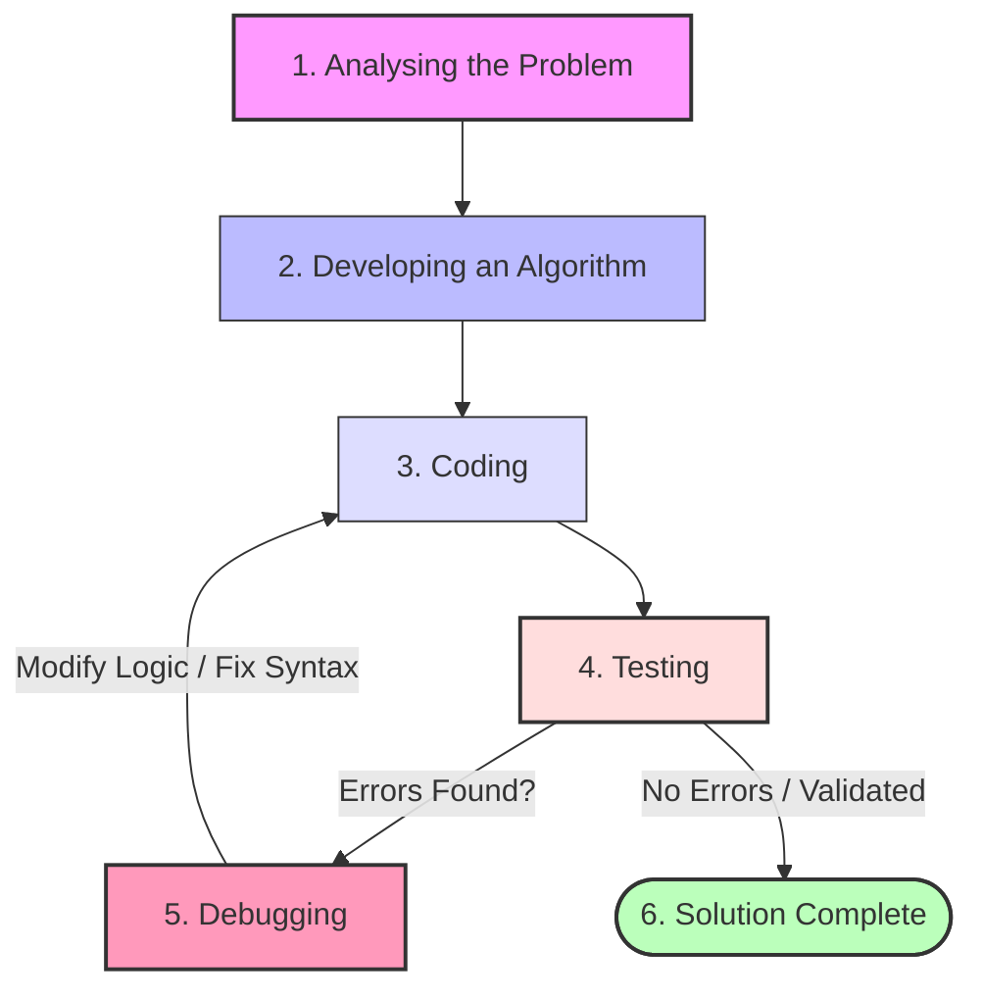
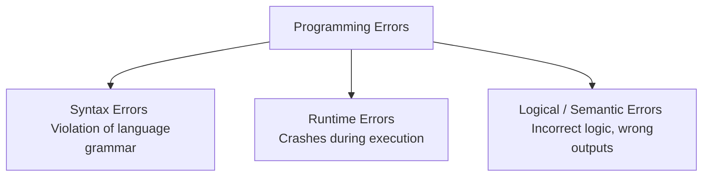

# Introduction to Problem Solving

## Part 1: What is Problem Solving?

In computer science, **Problem Solving** is the systematic process of defining a problem, identifying its root cause, and designing, implementing, and verifying an effective, logical solution using a computer. 

A computer cannot think on its own; it requires a structured set of instructions to perform any task. Therefore, humans must act as problem solvers to analyze real-world challenges and translate them into machine-executable code.

---

## Part 2: The Steps of Problem Solving

The problem-solving cycle is an iterative process. If an error is found at any stage, the developer may need to go back to a previous stage to make corrections.

---

## Part 3: Detailed Breakdown of Each Step

### 1. Analysing the Problem
Before attempting to solve a problem, you must thoroughly understand its nature, scope, constraints, and requirements. Jumping straight into writing code without analysis often leads to logical errors and inefficient software.

*   **Key Objectives:**
    *   **Define Requirements:** Understand what the user wants.
    *   **Identify Inputs:** What raw data will be supplied to the computer?
    *   **Identify Outputs:** What is the expected final result?
    *   **Understand Constraints:** What are the boundaries, memory limits, or rule limitations of the problem?
*   **The IPO Cycle:** Developers analyze the system using the Input-Process-Output model.
    $$\text{Input} \rightarrow \text{Processing (Logic)} \rightarrow \text{Output}$$

---

### 2. Developing an Algorithm
Once the requirements are fully understood, the developer creates a step-by-step plan or blueprint of the solution. This is known as developing an algorithm.

*   **Key Objectives:**
    *   Formulate a logical sequence of steps to transform inputs into outputs.
    *   Utilize tools like **Pseudocode** (informal text description) and **Flowcharts** (graphical visual flow) to represent logic.
    *   Review the algorithm to ensure it terminates (finiteness) and covers all possible boundary conditions.

---

### 3. Coding
Coding is the phase where the logical steps of the algorithm are translated into actual syntax using a specific programming language (such as Python, C++, or Java).

*   **Key Objectives:**
    *   Translate flowchart symbols or pseudocode instructions into language statements.
    *   Write clean, readable, and well-commented source code.
    *   Use correct syntax and appropriate data structures.

---

### 4. Testing
Testing is the process of executing the written program with various inputs (test cases) to verify that it functions correctly and produces the expected outputs.

*   **Key Objectives:**
    *   Verify that the software behaves correctly under different scenarios.
    *   Uncover any hidden bugs or operational errors.
*   **Types of Test Data:**
    1.  **Normal Test Data:** Standard, expected values to verify normal functioning (e.g., testing an addition program with positive integers).
    2.  **Boundary Test Data:** Values at the extreme limits of the acceptable range (e.g., testing with 0, empty files, or extremely large numbers).
    3.  **Invalid / Erroneous Test Data:** Incorrect data designed to check if the program crashes or handles errors gracefully (e.g., inputting text where a number is expected).

---

### 5. Debugging
If testing reveals incorrect outputs or program crashes, the developer must locate and fix the source of those problems. This diagnostic and corrective phase is called **Debugging**.

*   **Key Objectives:**
    *   Determine the exact location of the error (bug) within the code.
    *   Identify the root cause of the unexpected behavior.
    *   Modify the code to eliminate the error without introducing new bugs.

---

## Part 4: Testing vs. Debugging

Although closely related, testing and debugging are distinct phases of the development cycle.

| Feature | Testing | Debugging |
| :--- | :--- | :--- |
| **Primary Goal** | To **find** and reveal the presence of errors/bugs in the software. | To **locate, diagnose, and fix** the cause of identified errors. |
| **Who performs it?** | Can be done by independent software testers, automated tools, or users. | Performed primarily by programmers/developers who understand the source code. |
| **Execution Phase** | Run before debugging begins. | Initiated only after an error is discovered during testing. |
| **Methodology** | Done by inputting test cases and checking outputs (no code changes). | Done using tools like breakpoints, print statements, and step-by-step code execution to trace memory states. |

---

## Part 5: Types of Programming Errors

During the coding, testing, and debugging phases, programmers encounter three primary types of errors.

### A. Syntax Errors
*   **Definition:** These occur when the programmer violates the grammatical rules of the programming language.
*   **Detection:** Caught by the compiler or interpreter **before** the program can run. The program will not execute until all syntax errors are fixed.
*   **Examples:**
    *   Missing a colon `:` in Python statements like `if` or `for`.
    *   Unmatched parentheses `( )` or quotes `" "`.
    *   Misspelling language keywords (e.g., writing `prnt()` instead of `print()`).

### B. Runtime Errors
*   **Definition:** These occur when a grammatically correct program starts running but encounters an impossible or illegal operation during execution, causing the program to crash.
*   **Detection:** Caught during execution. The program stops running abruptly and displays an error message (exception trace).
*   **Examples:**
    *   **Division by Zero:** Attempting to divide a number by zero (e.g., `x = 5 / 0`).
    *   **Type Error:** Trying to add an integer to a string (e.g., `5 + "apple"`).
    *   **Index Error:** Trying to access an element beyond the size of a list (e.g., accessing index 10 in a list containing 3 items).
    *   **File Not Found:** Trying to open a file that does not exist on the storage drive.

### C. Logical (Semantic) Errors
*   **Definition:** These occur when the program runs smoothly without crashing but produces **incorrect or unexpected outputs**. They are caused by mistakes in the programmer's logic.
*   **Detection:** These are the **hardest to detect** because the compiler/interpreter cannot catch them, and the system does not crash. They can only be identified by thoroughly verifying output values against expected results during testing.
*   **Examples:**
    *   Using the wrong mathematical operator (e.g., calculating average as `Sum * Total` instead of `Sum / Total`).
    *   Using incorrect conditional operators (e.g., writing `if x < 10` instead of `if x <= 10`).
    *   Wrong variable initialization (e.g., initializing a running product variable to `0` instead of `1`, which results in a final answer of `0`).

---

## Quick Assessment / Review Questions

1.  **Why is problem analysis considered the most crucial step in problem-solving?**
    *   *Answer:* It ensures that you are solving the correct problem. Without proper analysis, you might build an elegant and error-free program that does not meet the user's actual requirements.
2.  **State the difference between Runtime and Logical errors with respect to program execution.**
    *   *Answer:* A runtime error causes the program to crash abruptly during execution and display an error message. A logical error does not crash the program; the execution completes successfully, but the final output is incorrect.
3.  **Suppose you write a Python code `y = 5 + "10"`. Which type of error will occur?**
    *   *Answer:* This will cause a **Runtime Error** (specifically a `TypeError` in Python) because the compiler/interpreter allows the syntax, but during execution, the processor cannot mathematically add an integer to a string.
4.  **How do boundary test cases help in testing an algorithm?**
    *   *Answer:* Boundary test cases test the algorithm at the extreme limits of its input ranges. Many logical bugs (such as off-by-one errors) occur at these boundaries, so checking them ensures the software is robust and reliable.